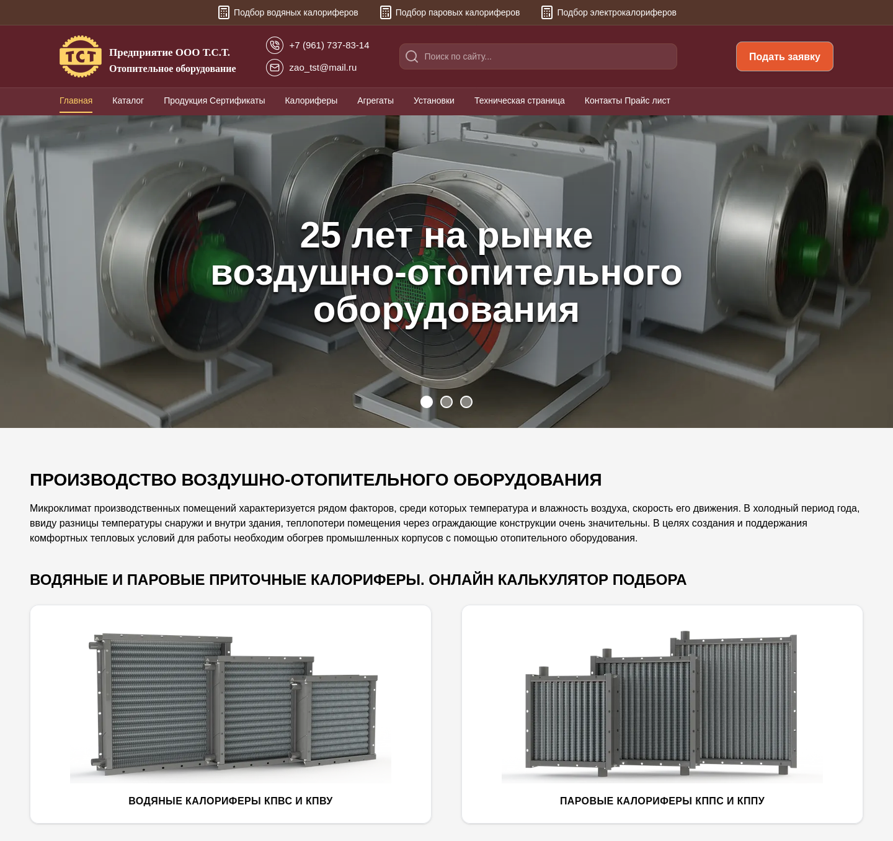
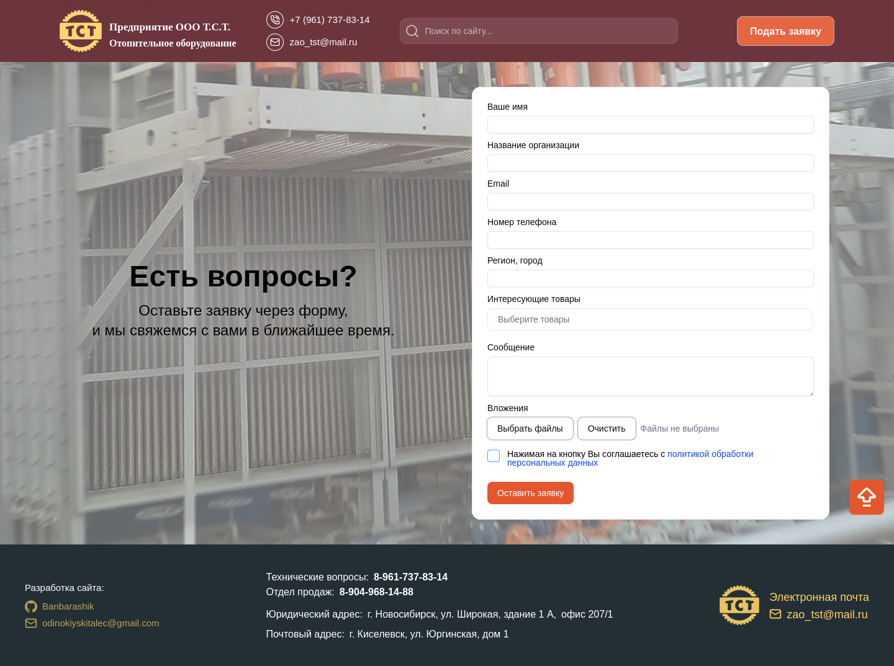
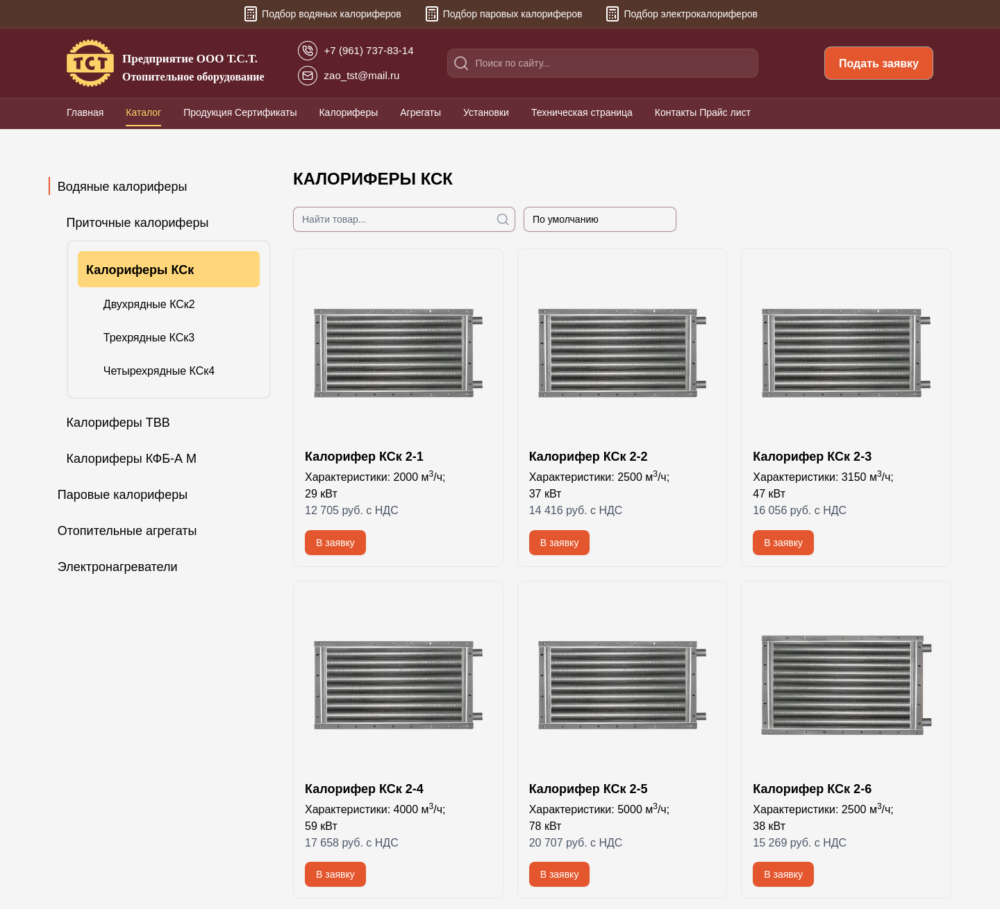
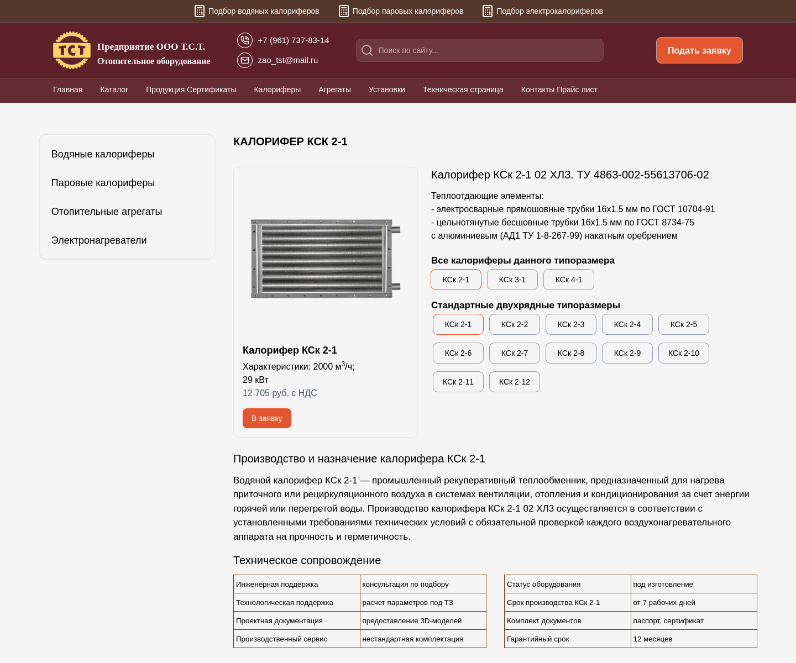
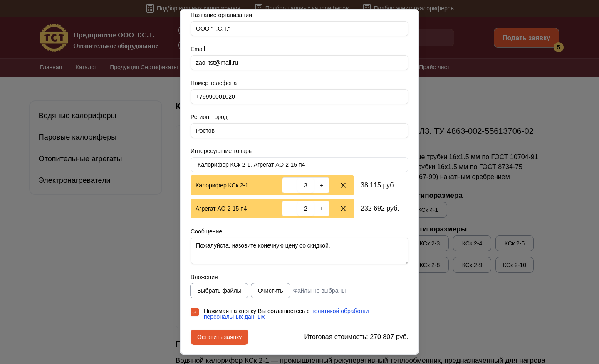

# T.S.T. LLC Website

A full-stack marketing and catalog website for a manufacturer of industrial air-heating equipment, built solo end-to-end — from data architecture and UI to deployment.

The project replaced a static HTML site with no catalog, search, or contact form. It now runs a data-driven product catalog covering hundreds of equipment models, technical engineering calculators, and a request-for-quote flow — all built without a database, using a structured JSON data layer.

You can compare the [old site](https://zao-tst-ru-old.netlify.app) with the [current version](https://zao-tst.ru) to see the scope of the redesign.

## Technical highlights

**Selection calculators with PDF export.** Each of the 96 individual supply heater product pages (covering every model and size of KPVS, KPVU, KPPS, and KPPU series) has its own selection calculator. These are fully my own implementation, built from scratch in React. The user enters airflow parameters, selects a coolant type and circuit, and receives calculated thermal performance data.

The output can be exported as a branded PDF document — generated client-side using @react-pdf/renderer — complete with the company's corporate template, color scheme, and logo. Each PDF contains a results table (with cells highlighted in red if values fall outside recommended ranges) and a second page with the technical drawing for that specific model, merged in via pdf-lib. The user can also trigger the browser's print dialog directly to get a print-ready version.

**JSON as the single source of truth.** The full product catalog — specs, categories, and cross-product relationships — lives in a structured JSON file, with related-product logic (same series, same size, companion products) resolved at runtime instead of hardcoded per page.

**Global site-wide search.** A fast, site-wide search experience was implemented using a prebuilt JSON search index and MiniSearch, delivering debounced queries, relevance ranking, highlighted snippets, and direct navigation across the catalog and content pages without relying on a database.

**Type-safe contact form.** Built with React Hook Form and Zod for schema-validated input, including file attachment support — the site's primary lead-generation channel.

**Interactive 3D product viewer.** One of the heater models is rendered as an interactive 3D scene on the homepage using Three.js / React Three Fiber, with a progressive loading UX (placeholder, progress bar, load-on-demand).

**Legacy content migration.** A large part of the project involved extracting and restructuring product data and technical specs from the [old static site](https://zao-tst-ru-old.netlify.app), including parsing legacy `.docx` documentation into structured data.

**SEO-first architecture.** Metadata, structured data, and legacy URL redirects were treated as first-class concerns rather than an afterthought, given the site's role in driving organic search traffic.

## Tech stack

- Next.js (App Router), React, TypeScript
- Tailwind CSS, shadcn/ui, Radix UI
- MiniSearch
- React Hook Form + Zod
- Three.js / React Three Fiber
- `@react-pdf/renderer`, `pdf-lib`
- Resend (transactional email)
- Docker, deployed on Timeweb Cloud

## Project structure

```text
app/                # Application routes and pages
components/         # Reusable UI components and page sections
constants/          # Shared constants and SEO configuration
context/            # React context providers
data/               # Product and content data
helpers/            # Utility helpers
hooks/              # Custom React hooks
lib/                # Business logic, utilities, and server-side helpers
public/             # Static assets, images, documents, and models
scripts/            # Build and maintenance scripts
types/              # TypeScript types
```

## Status

The site has been live in production since October 2025 and is actively maintained. It replaced a plain static HTML site with a fast, SEO-optimized, fully responsive experience that gives users the tools to actually explore the product range — and gives the company a functional channel for receiving inquiries.

## Visual demonstration

<p align="center">Home page (top)</p>



<p align="center">Home page (bottom)</p>



<p align="center">Catalog page</p>



<p align="center">Product page</p>



<p align="center">Contact form</p>


